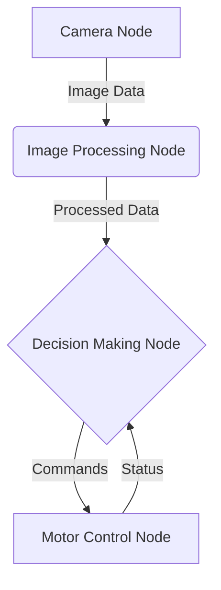

# Chapter 2: Core Concepts of ROS 2

Now that you have a high-level understanding of what ROS 2 is, let's dive into the fundamental concepts that form the building blocks of any ROS 2 system. These are the nouns and verbs of the ROS 2 language, and mastering them is key to becoming a proficient roboticist.

## The ROS 2 Graph

A ROS 2 system is often visualized as a "graph" – a network of interconnected processes that pass data to one another. The main elements of this graph are **nodes**, which communicate using **topics**, **services**, and **actions**.

Let's break down each of these components.

## Nodes

A **node** is the smallest unit of executable code in a ROS 2 system. Think of a node as a single-purpose program responsible for one specific task. For example, you might have:

- A node for controlling a camera.
- A node for processing image data from that camera.
- A node for controlling the robot's wheels.
- A node for planning a path for the robot to follow.

By breaking a complex system down into many small, modular nodes, ROS 2 makes the system easier to debug, maintain, and reuse.

## Topics

**Topics** are the primary mechanism for asynchronous, one-to-many communication in ROS 2. They are essentially named buses over which nodes can exchange messages.

- A node that sends messages to a topic is called a **publisher**.
- A node that receives messages from a topic is called a **subscriber**.

Multiple nodes can publish or subscribe to the same topic, making it a powerful tool for broadcasting data to many parts of the system at once.

**Use Case**: A camera node would *publish* image data to an `/image_raw` topic, and an image processing node would *subscribe* to that topic to receive the data.

## Services

**Services** are used for synchronous, one-to-one communication. They operate on a request-reply model, similar to a function call.

- A node that offers a service is called a **service server**.
- A node that requests the service is called a **service client**.

When a client calls a service, it sends a request and waits for a response from the server. This is useful for tasks that need to be completed before the client can proceed.

**Use Case**: A node might provide a `/move_to_goal` service. A client could call this service with a specific location, and the service would only return a response after the robot has successfully reached that location.

## Actions

**Actions** are similar to services, but they are designed for long-running tasks. They provide feedback during their execution and are cancellable.

An action has three parts:
1.  **A Goal**: The request sent by the client to the server.
2.  **Feedback**: Messages sent by the server to the client to provide updates on the task's progress.
3.  **A Result**: A final message sent by the server to the client upon completion.

**Use Case**: Navigating a robot to a complex destination is a perfect use case for an action. The client sends the goal (the destination), the server provides feedback (the robot's current position), and a result is sent when the destination is reached. The client can also cancel the navigation at any time.

## Parameters

**Parameters** allow you to configure nodes externally without recompiling the code. Each node can have a set of parameters that can be set at runtime. This is extremely useful for tuning and reconfiguring your robot's behavior.

**Use Case**: A camera node might have a `frame_rate` parameter that can be adjusted to change how many images it publishes per second.

By understanding and combining these core concepts, you can start to build powerful and flexible robotic systems with ROS 2. In the next chapters, we'll put these concepts into practice.
