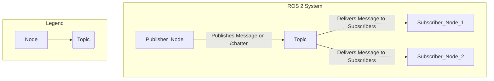

# Chapter 3: The Publisher-Subscriber Pattern

In the previous chapter, you learned about the core concepts of ROS 2. Now, it's time to put that knowledge into practice by implementing the most common communication pattern in ROS 2: the **publisher-subscriber** (or "pub-sub") model.

## The Pub-Sub Model

The pub-sub model is all about one-way, asynchronous communication.
- A **publisher** is a node that sends out data on a specific topic.
- A **subscriber** is a node that listens for data on that topic.

This decoupled approach is incredibly powerful. The publisher doesn't know or care who is listening, and the subscriber doesn't know or care who is sending the data. They only need to agree on the topic name and the message type.



## "Hello World" in ROS 2

Let's create a classic "Hello World" example with a publisher node that sends string messages and a subscriber node that receives and prints them.

### 1. Creating a ROS 2 Package

First, let's create a new ROS 2 package to hold our code.

```bash
# Navigate to your colcon workspace's src directory
cd ~/ros2_ws/src

# Create a new package
ros2 pkg create --build-type ament_python py_pubsub
```

This creates a new directory `py_pubsub` with the basic structure for a Python-based ROS 2 package.

### 2. The Publisher Node

Now, let's create the publisher node. Inside the `py_pubsub/py_pubsub` directory, create a new file named `publisher_member_function.py` with the following content:

```python
import rclpy
from rclpy.node import Node
from std_msgs.msg import String

class MinimalPublisher(Node):

    def __init__(self):
        super().__init__('minimal_publisher')
        self.publisher_ = self.create_publisher(String, 'topic', 10)
        timer_period = 0.5  # seconds
        self.timer = self.create_timer(timer_period, self.timer_callback)
        self.i = 0

    def timer_callback(self):
        msg = String()
        msg.data = 'Hello World: %d' % self.i
        self.publisher_.publish(msg)
        self.get_logger().info('Publishing: "%s"' % msg.data)
        self.i += 1

def main(args=None):
    rclpy.init(args=args)
    minimal_publisher = MinimalPublisher()
    rclpy.spin(minimal_publisher)
    minimal_publisher.destroy_node()
    rclpy.shutdown()

if __name__ == '__main__':
    main()
```

### 3. The Subscriber Node

Next, create the subscriber node in the same directory. Create a file named `subscriber_member_function.py`:

```python
import rclpy
from rclpy.node import Node
from std_msgs.msg import String

class MinimalSubscriber(Node):

    def __init__(self):
        super().__init__('minimal_subscriber')
        self.subscription = self.create_subscription(
            String,
            'topic',
            self.listener_callback,
            10)
        self.subscription  # prevent unused variable warning

    def listener_callback(self, msg):
        self.get_logger().info('I heard: "%s"' % msg.data)

def main(args=None):
    rclpy.init(args=args)
    minimal_subscriber = MinimalSubscriber()
    rclpy.spin(minimal_subscriber)
    minimal_subscriber.destroy_node()
    rclpy.shutdown()

if __name__ == '__main__':
    main()
```

### 4. Building and Running

To make these nodes executable, we need to add them to `setup.py` in the root of our `py_pubsub` package:

```python
# In setup.py, find the entry_points section and add:
'console_scripts': [
    'talker = py_pubsub.publisher_member_function:main',
    'listener = py_pubsub.subscriber_member_function:main',
],
```

Now, let's build and run our nodes:

```bash
# Navigate to the root of your colcon workspace
cd ~/ros2_ws

# Build the workspace
colcon build --packages-select py_pubsub

# Source the setup files
source install/setup.bash

# Run the publisher in one terminal
ros2 run py_pubsub talker

# Run the subscriber in another terminal
ros2 run py_pubsub listener
```

You should now see the "Hello World" messages being published by the talker and received by the listener!

Congratulations, you've just created your first ROS 2 publisher and subscriber. In the next chapter, we'll explore services and actions.
