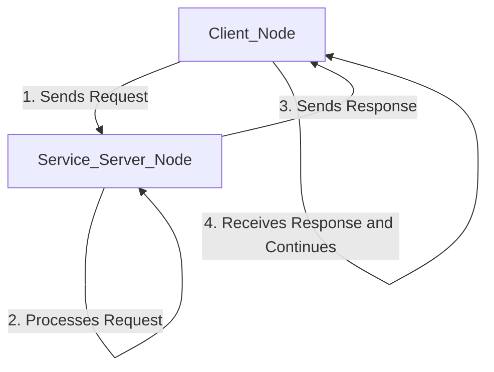

--- 
sidebar_position: 4
---

# Chapter 4: Services and Actions

While topics are great for continuous data streams, ROS 2 provides two other important communication patterns for request-reply style interactions: **Services** and **Actions**.

## Services: Synchronous Communication

A **service** is a synchronous, one-to-one communication mechanism. When a client calls a service, it sends a request and **waits** for the server to send back a response. This is ideal for tasks that are quick and must be completed before the client can continue.



### Example: A Simple "Add Two Ints" Service

Let's create a service that adds two integers.

#### 1. Defining a Service (`.srv` file)

First, we need to define the service's structure in a `.srv` file. Create a directory named `srv` in your `py_pubsub` package and add a file named `AddTwoInts.srv`:

```
int64 a
int64 b
---
int64 sum
```
The first part is the request, and the part after the `---` is the response.

#### 2. The Service Server

Now, create a service server node in `py_pubsub/py_pubsub/service_member_function.py`:

```python
from example_interfaces.srv import AddTwoInts
import rclpy
from rclpy.node import Node

class MinimalService(Node):

    def __init__(self):
        super().__init__('minimal_service')
        self.srv = self.create_service(AddTwoInts, 'add_two_ints', self.add_two_ints_callback)

    def add_two_ints_callback(self, request, response):
        response.sum = request.a + request.b
        self.get_logger().info('Incoming request\na: %d b: %d' % (request.a, request.b))
        return response

def main(args=None):
    rclpy.init(args=args)
    minimal_service = MinimalService()
    rclpy.spin(minimal_service)
    rclpy.shutdown()

if __name__ == '__main__':
    main()
```

#### 3. The Service Client

Next, create the client in `py_pubsub/py_pubsub/client_member_function.py`:

```python
import sys
from example_interfaces.srv import AddTwoInts
import rclpy
from rclpy.node import Node

class MinimalClientAsync(Node):

    def __init__(self):
        super().__init__('minimal_client_async')
        self.cli = self.create_client(AddTwoInts, 'add_two_ints')
        while not self.cli.wait_for_service(timeout_sec=1.0):
            self.get_logger().info('service not available, waiting again...')
        self.req = AddTwoInts.Request()

    def send_request(self):
        self.req.a = int(sys.argv[1])
        self.req.b = int(sys.argv[2])
        self.future = self.cli.call_async(self.req)

def main(args=None):
    rclpy.init(args=args)
    minimal_client = MinimalClientAsync()
    minimal_client.send_request()

    while rclpy.ok():
        rclpy.spin_once(minimal_client)
        if minimal_client.future.done():
            try:
                response = minimal_client.future.result()
            except Exception as e:
                minimal_client.get_logger().info(
                    'Service call failed %r' % (e,))
            else:
                minimal_client.get_logger().info(
                    'Result of add_two_ints: for %d + %d = %d' %
                    (minimal_client.req.a, minimal_client.req.b, response.sum))
            break

    minimal_client.destroy_node()
    rclpy.shutdown()

if __name__ == '__main__':
    main()
```

After updating `setup.py` and `CMakeLists.txt` (to find the custom service definition) and rebuilding, you can run the service and client.

## Actions: Asynchronous, Long-Running Tasks

**Actions** are for long-running tasks. Unlike services, they are asynchronous, provide continuous feedback, and are cancellable.

An action consists of a **Goal**, **Feedback**, and a **Result**.

### Example: Fibonacci Action

Let's create an action that computes the Fibonacci sequence.

#### 1. Defining an Action (`.action` file)

Create a directory `action` in your `py_pubsub` package and a file `Fibonacci.action`:
```
int32 order
---
int32[] sequence
---
int32[] partial_sequence
```

#### 2. The Action Server

The action server executes the long-running goal. The code for this is more involved than a service.

#### 3. The Action Client

The action client sends the goal and can receive feedback and the final result.

Due to the complexity, we will not show the full code here, but you can find detailed tutorials in the official ROS 2 documentation.

By using services for quick, synchronous tasks and actions for long-running, asynchronous ones, you can build more complex and robust robotic behaviors.

