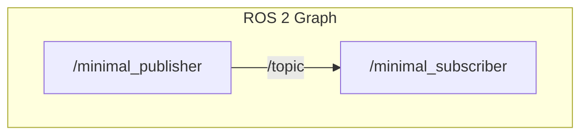

# Chapter 6: Debugging ROS 2 Applications

As your robotics applications grow in complexity, you will inevitably encounter bugs and unexpected behavior. ROS 2 provides a powerful set of command-line and graphical tools to help you debug your system.

## Logging

The most fundamental debugging tool is logging. We've already seen the `get_logger().info()` function in our previous examples. ROS 2 provides several logging levels:

-   `DEBUG`: Detailed information, typically of interest only when diagnosing problems.
-   `INFO`: Confirmation that things are working as expected.
-   `WARN`: An indication that something unexpected happened, but the system can still continue.
-   `ERROR`: A serious problem that will likely prevent the current operation from completing.
-   `FATAL`: A critical error that will cause the node to shut down.

You can set the logging level of a node to see more or less detail, which is incredibly helpful for pinpointing issues.

```bash
# Run a node with a specific logging level
ros2 run my_package my_node --ros-args --log-level DEBUG
```

## `rqt_graph`

`rqt_graph` is a graphical tool that visualizes the ROS 2 computation graph. It shows you which nodes are running, what topics they are publishing and subscribing to, and how they are all connected.

This is an invaluable tool for understanding the architecture of a complex system and for debugging communication issues between nodes.

To run `rqt_graph`, simply execute the following command in a terminal (after sourcing your ROS 2 environment):

```bash
rqt_graph
```

You will see a graph similar to this for our publisher-subscriber example:



## `ros2 doctor`

`ros2 doctor` is a command-line tool that checks your ROS 2 setup for potential issues. It can detect problems with your network configuration, environment variables, and more.

If you are having trouble with nodes not being able to communicate, `ros2 doctor` is a great first step in diagnosing the problem.

```bash
ros2 doctor
```

The tool will provide a report of any warnings or errors it finds and suggest potential solutions.

## Introspection Tools

ROS 2 also provides a rich set of command-line tools for introspecting the system:

-   `ros2 topic list`: Lists all the topics currently being published.
-   `ros2 topic echo <topic_name>`: Prints the messages being published on a specific topic.
-   `ros2 node list`: Lists all the running nodes.
-   `ros2 node info <node_name>`: Shows detailed information about a specific node, including its subscriptions, publications, services, and actions.

By mastering these debugging and introspection tools, you will be well-equipped to diagnose and solve problems in your ROS 2 applications.
